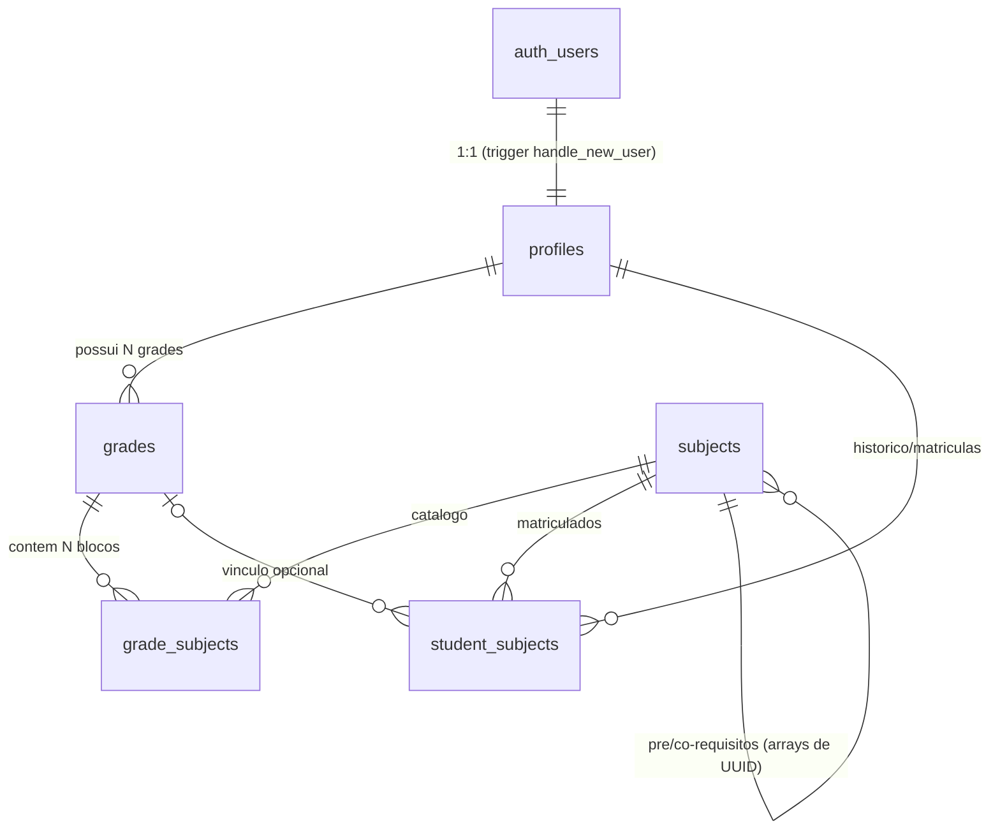

# 📐 Schema do Banco de Dados — Grade Horária BSI

> **Projeto Supabase:** `zhcubvmismnmvtrbolbu` | **Gerado em:** 16/09/2026
> Fonte de verdade: estrutura extraída do banco ao vivo (`supabase/describe_schema.js`), não apenas do `schema.sql`.

---

## 1. Visão Geral (ER)

## 2. Tabelas

### 2.1 `profiles` — usuários
| Coluna | Tipo | Detalhe |
|---|---|---|
| id | uuid PK | FK → `auth.users(id)` ON DELETE CASCADE |
| email | text NOT NULL | |
| full_name | text | vem de `raw_user_meta_data->>'full_name'` no signup |
| role | enum `user_role` | `'admin' \| 'student'` (default student) |
| avatar_url | text | |
| created_at / updated_at | timestamptz | trigger `update_updated_at_column` |

**Regra:** `aphmgbr@gmail.com` vira `admin` automaticamente no trigger `handle_new_user`.

### 2.2 `subjects` — catálogo de matérias (65 reais, 40 c/ pré-req, 37 c/ co-req)
| Coluna | Tipo | Detalhe |
|---|---|---|
| id | uuid PK | |
| code | text UNIQUE NOT NULL | id legível vindo do `dados.js` (ex: `prog1`, `bd1`) |
| name | text NOT NULL | |
| credits | int, default 4 | |
| workload | int, default 60 | carga horária (ver §4.2) |
| professor | text | |
| semester | int | período sugerido (1–10) |
| prerequisites | uuid[] | FKs lógicas para outros subjects |
| corequisites | uuid[] | idem |
| schedule | jsonb | `{"monday": [{"start":"13:00","end":"14:40","room":"S312"}]}` |
| description | text | |
| is_active | bool, default true | soft-delete (matéria some do catálogo mas não apaga histórico) |
| created_at / updated_at | timestamptz | |

### 2.3 `grades` — grade horária de um aluno
| Coluna | Tipo | Detalhe |
|---|---|---|
| id | uuid PK | |
| student_id | uuid NOT NULL FK → profiles(id), CASCADE | |
| name | text, default 'Minha Grade' | |
| semester / year | int NOT NULL | qual período letivo |
| is_active | bool, default true | uma grade ativa por período |
| is_public | bool, default false | **compartilhamento com colegas** |
| created_at / updated_at | | |
| UNIQUE(student_id, semester, year, is_active) | | |

### 2.4 `grade_subjects` — blocos de aula dentro de uma grade
| Coluna | Tipo | Detalhe |
|---|---|---|
| id | uuid PK | |
| grade_id | uuid NOT NULL FK → grades(id), CASCADE | |
| subject_id | uuid NOT NULL FK → subjects(id), CASCADE | |
| day | enum `day_of_week` | monday…saturday |
| time_start / time_end | time NOT NULL | |
| classroom | text | |
| color | text, default '#3B82F6' | cor do bloco na UI |
| UNIQUE(grade_id, subject_id) | | uma matéria não duplica dentro da grade |

### 2.5 `student_subjects` — histórico e vínculo aluno↔matéria
| Coluna | Tipo | Detalhe |
|---|---|---|
| id | uuid PK | |
| student_id | uuid NOT NULL FK → profiles, CASCADE | |
| subject_id | uuid NOT NULL FK → subjects, CASCADE | |
| grade_id | uuid FK → grades, ON DELETE SET NULL | grade em que cursou (opcional) |
| status | text CHECK | `'enrolled' / 'completed' / 'dropped' / 'pending'` |
| final_grade | numeric(4,2) | nota final |
| UNIQUE(student_id, subject_id, grade_id) | | |

---

## 3. Segurança (RLS) — 14 policies, todas testadas

| Tabela | Leitura | Escrita |
|---|---|---|
| profiles | todos veem | só o próprio usuário; admin gerencia todos |
| subjects | público (`is_active = true`) | só admin |
| grades | dono + grades públicas | só o dono |
| grade_subjects | segue a grade pai | só o dono da grade |
| student_subjects | próprio + **colegas da mesma matéria** | só o próprio aluno |

- Anti-recursão: função `public.is_admin()` (SECURITY DEFINER STABLE).
- Realtime habilitado nas 5 tabelas (`supabase_realtime`).
- Teste automatizado: `supabase/test_api.js` — login, profile via trigger, leitura anon de subjects, **bloqueio de escrita anon provado**.

## 4. Status das Regras de Negócio

### 4.1 🔒 Cadeado de pré-requisitos — ✅ ESTRUTURA ÍNTEGRA
- Dados: `subjects.prerequisites` / `corequisites` (UUID[] resolvidos a partir do `dados.js`).
- "Aprovado" = `student_subjects.status = 'completed'`.
- **Enforcement hoje: no front-end** (`logica.js` bloqueia seleção e mostra 🔒 + lista de pré-reqs).
- ⚠️ **Gap:** o banco não impede `INSERT` em `grade_subjects` sem pré-requisito cumprido. Se quiserem enforcement server-side, criar função/BEFORE INSERT trigger. Recomendo discutir com o arquiteto antes.

### 4.2 📉 Limite de faltas por carga horária — ❌ NÃO IMPLEMENTADO
- Não há tabela de presenças/faltas nem no banco nem no front.
- Base já existe: `subjects.workload` + `grade_subjects` (dia/horário).
- **Proposta mínima** (pendente aprovação): tabela `attendance`:
  - `id`, `student_id` FK→profiles, `subject_id` FK→subjects, `date` date, `absent` bool (ou `hours_absent` numeric), UNIQUE(student_id, subject_id, date)
  - Regra: reprovação por falta quando `SUM(faltas) > 0.25 × workload` (25% — verificar regimento CEFET).
- Decidir com o arquitetos: falta por **dia de aula** vs por **hora-aula** muda bastante o modelo.

## 5. Rotinas de Manutenção (scripts em `supabase/`)
| Script | Uso |
|---|---|
| `db.js` | conexão via `../.env` |
| `reset_schema.js` | reset DESTRUTIVO + reaplica schema.sql |
| `execute_schema.js` | reaplica schema (não destrutivo) |
| `seed_subjects.mjs` | sincroniza 65 matérias do `dados.js` → banco (idempotente) |
| `fix_users.js` | backfill de profiles |
| `test_api.js` | bateria end-to-end (6/6) |
| `describe_schema.js` | gera a estrutura real (origem deste documento) |
