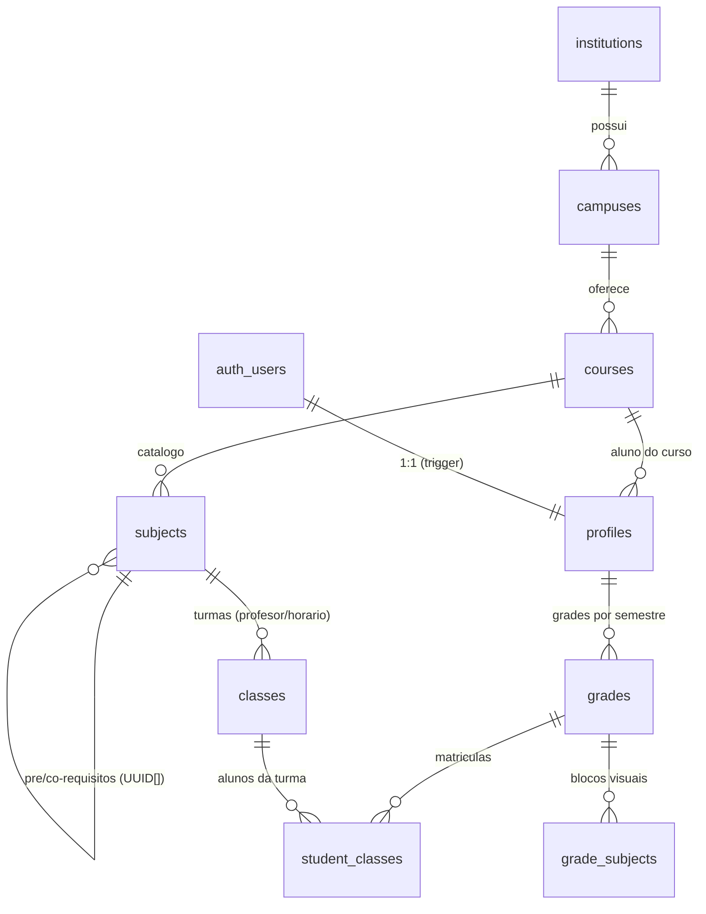

# 📐 Schema do Banco de Dados v2 — Grade Horária BSI

> **Projeto Supabase:** `zhcubvmismnmvtrbolbu` | **Versão:** 2.0 (16/09/2026)
> **Modelo aprovado pela arquitetura:** hierarquia multi-instituicao + separacao subject/class + trigger de pre-requisitos no banco.
> **Fora de escopo:** chat interno e import/export JSON (app 100% nuvem).

---

## 1. Visão Geral (ER)

## 2. Tabelas

### A. Hierarquia institucional
**`institutions`** — id, name, acronym UNIQUE (ex: `CEFET-MG`), state
**`campuses`** — id, institution_id FK, name (ex: `Varginha`), city; UNIQUE(institution_id, name)
**`courses`** — id, campus_id FK, name (ex: `Sistemas de Informação`); UNIQUE(campus_id, name)

### B. `profiles` — usuários
id (FK auth.users CASCADE) | email | full_name | role enum(`admin`,`student`) | **course_id FK→courses** | **avatar_url** | **is_public** (default true) | created_at/updated_at
- `aphmgbr@gmail.com` vira admin via trigger `handle_new_user`.

### C. Catálogo separado de turma
**`subjects`** (disciplina base) — id | code UNIQUE (chave interna de seed) | **course_id FK** | name | **workload_hours** CHECK IN (30,60,90) | prerequisites UUID[] | corequisites UUID[] | description | is_active
**`classes`** (turma real) — id | subject_id FK CASCADE | professor_name | semester | schedule JSONB `{dia:[{start,end,room}]}` | **social_group_link** | is_active | UNIQUE(subject_id, professor_name, semester) *(chave interna p/ seed idempotente)*

### D. Grade e vínculo do aluno
**`grades`** — id | student_id FK→profiles CASCADE | name | semester | year | is_active | is_public | UNIQUE(student_id, semester, year, is_active)
**`grade_subjects`** — id | grade_id FK CASCADE | subject_id FK CASCADE | day enum | time_start/time_end | classroom | color | UNIQUE(grade_id, subject_id)
**`student_classes`** — id | grade_id FK CASCADE | class_id FK CASCADE | status CHECK(`enrolled/completed/dropped/pending`) | final_grade NUMERIC(4,2) | **absences INT default 0** | UNIQUE(grade_id, class_id)

## 3. 🔒 Trigger de segurança — pré-requisitos NO BANCO

**`trg_check_prerequisites`** — `BEFORE INSERT ON student_classes` → `public.check_prerequisites()` (SECURITY DEFINER)

1. Resolve aluno via `grade_id → grades.student_id`
2. Resolve disciplina via `class_id → classes.subject_id`
3. Para cada `prerequisite` do subject: exige registro do **mesmo aluno** (qualquer grade) com `status='completed'` numa turma daquela disciplina
4. Faltando qualquer um → `RAISE EXCEPTION 'Pre-requisitos nao cumpridos: <nomes>'` (ERRCODE 23514) → **API rejeita o INSERT**

### Prova (test_trigger.js — 10/10 PASS):
| # | Teste | Resultado |
|---|---|---|
| 1 | Matricular `prog2` sem pré-req | ❌ **BLOQUEADO** pelo banco |
| 2 | Matricular `prog1`/`lab_prog` | ✅ |
| 3 | Marcar ambos `completed` | ✅ |
| 4 | Matricular `prog2` depois | ✅ **LIBERADO** |
| 5 | Registrar `absences=6` | ✅ |
| 6 | INSERT anônimo | ❌ bloqueado (RLS) |

## 4. Regra de faltas (25%)
**Decisão arquitetural:** o banco guarda SÓ o contador `student_classes.absences` (horas-aula). Não há tabela de chamada diária. A interface calcula: `reprovado_por_falta = absences > 0.25 * subjects.workload_hours`.

## 5. RLS (22 policies)
| Tabela | Leitura | Escrita |
|---|---|---|
| institutions/campuses/courses | pública | admin |
| profiles | públicos (is_public) ou próprio | próprio; admin |
| subjects/classes | ativas públicas | admin |
| grades | dono ou pública | dono |
| grade_subjects | segue a grade | dono da grade |
| student_classes | dono ou **colega de turma** (`shares_class()`) | dono |

Anti-recursão: `is_admin()` e `shares_class()` são `SECURITY DEFINER`.
Realtime ativo: profiles, subjects, classes, grades, grade_subjects, student_classes.

## 6. Scripts (`supabase/`)
| Script | Uso |
|---|---|
| `db.js` | conexão via `../.env` |
| `reset_schema.js` | reset destrutivo + aplica schema.sql |
| `seed_subjects.mjs` | hierarquia + 65 subjects + 65 classes do `dados.js` (idempotente) |
| `fix_users.js` | backfill de profiles |
| `test_api.js` | bateria auth/RLS básica |
| `test_trigger.js` | bateria do trigger de pré-requisitos (10/10) |
| `describe_schema.js` | introspecção do banco |
