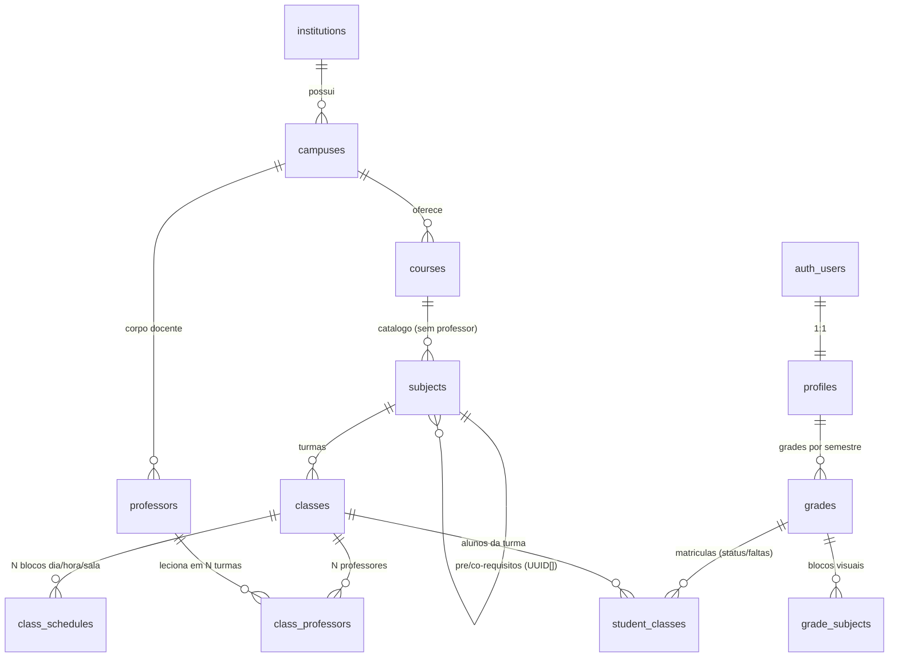

# 📐 Schema do Banco de Dados v3 — Grade Horária BSI

> **Projeto Supabase:** `zhcubvmismnmvtrbolbu` | **Versão:** 3.0 (16/09/2026)
> **v3:** normalização rigorosa — professores em tabela própria, fim do JSONB de horários, trava de choque de horários no banco, índices de busca.

---

## 1. Visão Geral (ER)

## 2. Tabelas

### A. Hierarquia institucional
- **institutions** — id, name, acronym UNIQUE, state
- **campuses** — id, institution_id FK, name, city; UNIQUE(institution_id, name)
- **courses** — id, campus_id FK, name; UNIQUE(campus_id, name)

### B. profiles
id (FK auth.users CASCADE) | email | full_name | role enum | course_id FK | avatar_url | is_public (default true) | timestamps

### C. Catálogo normalizado
| Tabela | Colunas | Índices |
|---|---|---|
| **subjects** | id, code UNIQUE (interno), course_id FK, name, workload_hours CHECK(30/60/90), prerequisites UUID[], corequisites UUID[], description, is_active | PK, code |
| **professors** | id, name, campus_id FK; UNIQUE(name, campus_id) | **idx_professors_name** (busca textual) |
| **classes** | id, code UNIQUE (interno, ex: `prog1-A`), subject_id FK CASCADE, semester, social_group_link, is_active | |
| **class_professors** | class_id FK CASCADE, professor_id FK CASCADE; PK composta | N:N |
| **class_schedules** | id, class_id FK CASCADE, day_of_week INT CHECK(0-6), start_time TIME, end_time TIME, room, CHECK(start<end) | **idx_class_schedules_day**, **idx_class_schedules_start** |

### D. Aluno
- **grades** — student_id FK CASCADE, name, semester, year, is_active, is_public; UNIQUE(student_id, semester, year, is_active)
- **grade_subjects** — grade_id, subject_id FKs, day enum, time_start/end, classroom, color; UNIQUE(grade_id, subject_id)
- **student_classes** — grade_id FK CASCADE, class_id FK CASCADE, status CHECK(enrolled/completed/dropped/pending), final_grade, **absences** INT >= 0; UNIQUE(grade_id, class_id)

## 3. Travas de segurança no banco (triggers)

### 3.1 🔒 `trg_check_prerequisites` — BEFORE INSERT em `student_classes`
Bloqueia matrícula se faltar pré-requisito com `status='completed'` no histórico do aluno (qualquer grade). Erro 23514 com nomes das matérias faltantes.

### 3.2 ⏰ `trg_check_time_conflict` — BEFORE INSERT OR UPDATE em `student_classes`
Só avalia quando `status='enrolled'`. Para cada bloco `class_schedules` da turma nova, cruza com os blocos das turmas `enrolled` do aluno (todas as grades) no mesmo `day_of_week`:

**Conflito ⟺ (novo.start < velho.end) AND (velho.start < novo.end)** — fronteira exata (16:40 → 16:40) **NÃO** é conflito.
Erro 23514: `Choque de horario com a materia: <nome>`.

## 4. Faltas (regra de 25%)
Banco guarda só `student_classes.absences`. UI calcula: `reprovado = absences > 0.25 * subjects.workload_hours`.

## 5. RLS (28 policies)
- institutions/campuses/courses/professors/classes/class_professors/class_schedules: leitura pública, escrita admin
- subjects: ativas públicas; admin CRUD
- profiles: público (is_public) ou próprio; edição própria; admin total
- grades: dono ou pública
- grade_subjects: segue grade
- student_classes: dono OU colega de turma (`shares_class()`)
- Anti-recursão: `is_admin()` e `shares_class()` SECURITY DEFINER
- Realtime: 9 tabelas

## 6. Provas automatizadas
| Bateria | Resultado |
|---|---|
| `test_mock_flow.js` (fluxo completo, 3 alunos) | 16/16 |
| `test_normalization.js` | 8/8 |
| (A) busca cruzada matéria + professor + dia | ✅ |
| (B) 2 professores na mesma turma ("Weider/Marcelo" → 2 vínculos) | ✅ |
| (C) sequência exata 16:40→16:40 permitida | ✅ |
| (D) choque real bloqueado pelo banco | ✅ |

## 7. Scripts (`supabase/`)
| Script | Uso |
|---|---|
| `db.js` | conexão via `../.env` |
| `reset_schema.js` | reset destrutivo + aplica schema.sql |
| `seed_subjects.mjs` | 65 disciplinas → 65 subjects + 27 professores + 65 classes + 72 vínculos + 89 blocos de horário (idempotente) |
| `create_mock_users.js` / `cleanup_mocks.js` | usuários fictícios completos / limpeza em cascata |
| `test_mock_flow.js` | 16 testes de fluxo real |
| `test_normalization.js` | 8 testes de normalização/choque |
| `test_api.js` / `fix_users.js` / `describe_schema.js` | baterias auxiliares |